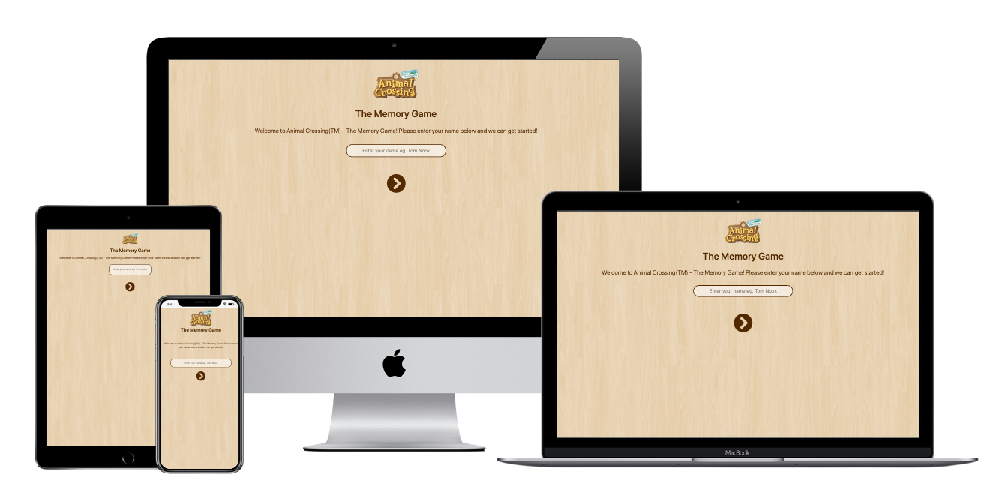

 New Horizons Logo")
# Animal Crossing (TM) New Horizons - The Memory Game

Memory game (or match the pairs game) inspired by a viral Nintendo Switch game Animal Crossing New Horizons. 

## Live demo

Live demo of the website can be found at [this link](https://ib-skoric.github.io/ci-acnhmg/).

 
## UX

### User stories

As a user I want to navigate through the game UI and play the game

As a user I want to have fun

### Strategy

The main goal is for the user to be able to naviagte the game easily and for the user to have fun.

### Scope

The application guides the user through the rules and allows the user to play the game.

### Structure

The landing page features the logo, title and a input field for the user to input their name. Underneath the input field is a call to action button that leads the user to the next page - rules.

Rules page contains image of Tim Nook (lead character in the game and Nook Inc. owner) and a speach bubble through witch the user navigates by clicking or tapping the same call to aciton button.

After user goes through the rules, user is brought to the game screen that consists of the logo, timer and 12 cards.

Once user completes level 1 in time a page clears and displays a congratulations message and 2 buttons to either proceed to next level or cancel the game.

Once user completes level 2 in time a page clears and displays a congratulations message and 2 buttons to either proceed to next level or cancel the game.

Once user completes level 3 in time a page clears and displays a congratulations message and 2 buttons to either replay the game or go back to home page.

### Skeleton

[Landing page wirefrime](assets/docs/landing-wireframe.png)

[Rules page wirefrime](assets/docs/rules-wireframe.png)

[Game page wirefrime](assets/docs/game-wireframe.png)

### Surface 

Colour used as a main colour is #532901 (pictured below). This colour has been used for text and button elements throught the page.

Background image used is a wood background that repeats across the entire site. *(see credits)*

## Features
 
### Existing Features

The game features a user input element and a simple introduction to the game to help user undestand the rules of the game.

The game itself consists of a 12 cards (6 pairs) which user has to match within set time (90 seconds).

The game has 3 different levels - matching Animal Crossing(TM) villagers at level 1, fish at level 2 & insects at level 3.

Users progression is saved to session storage so it can be retreived later if the user decides to play the game at later date.

After every level (apart from last) user can choose weather to proceed to next level or to cancel the game.

### Features Left to Implement

It would be great to implement a database for storing player data and progression as well as more levels & a leaderboard that would pull the data for the aforementioned database. 

## Technologies Used

1. HTML5
2. CSS3
3. [Bootstrap v4.4.1](https://getbootstrap.com/)
4. jQuery (only as part of Bootstrap)
5. [Font Awesome](https://fontawesome.com/start)
6. JavaScript 

## Testing

## Deployment

This website has been deployed and is hosted on GitHub Pages. It has been deployed straight from *master* branch. This has been done by navigating to the repository > Clicking on *Settings* > Scrolling down to *GitHub Pages* section > Selecting *master branch* as a source. 

The page will update automatically with new/changed content once commits are pushed to the remote repo location using `git push` command. 

If you wish to clone this repository, this can be done using `git clone https://github.com/ib-skoric/ci-acnhmg.git`

## Credits

### Content

All textual content has been written by myself. 

I have loosely followed [this tutorial]('https://www.taniarascia.com/how-to-create-a-memory-game-super-mario-with-plain-javascript/') to get the core idea of how to structure the JavaScript application, and builded up the rest of the features myself.

### Media

Background image has been sourced from [toptal.com](https://www.toptal.com/designers/subtlepatterns/retina-wood/).

Sound files have been sourced from [soundbible.com](http://soundbible.com/) and are under copyright of their respective owners - licences vary.

All Animal Crossing (TM) images including images of the villagers, fish & insects has been sourced from [Critterpedia Plus](https://critterpedia-plus.mutoo.im/) and these are courtesy of Nintendo Comapny.

Animal Crossing and Nintendo Switch are trademarks of Nintendo. 

### Acknowledgements

